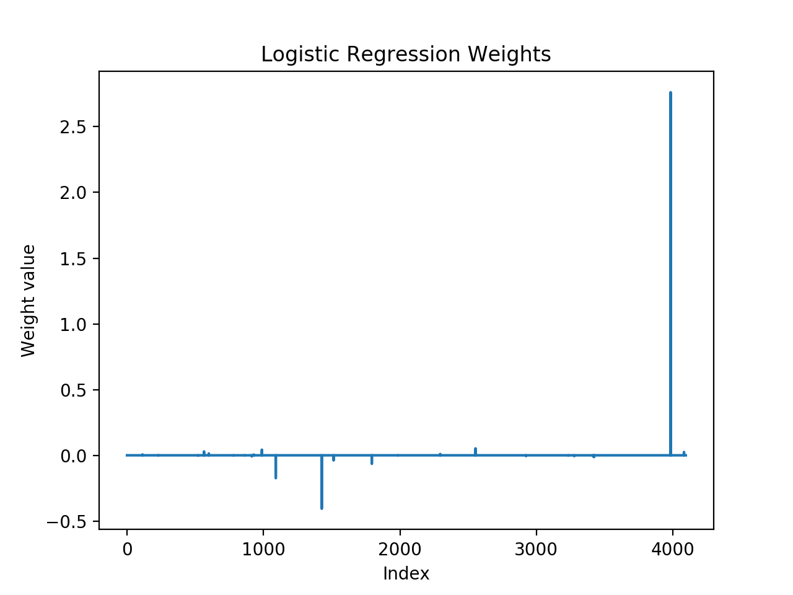
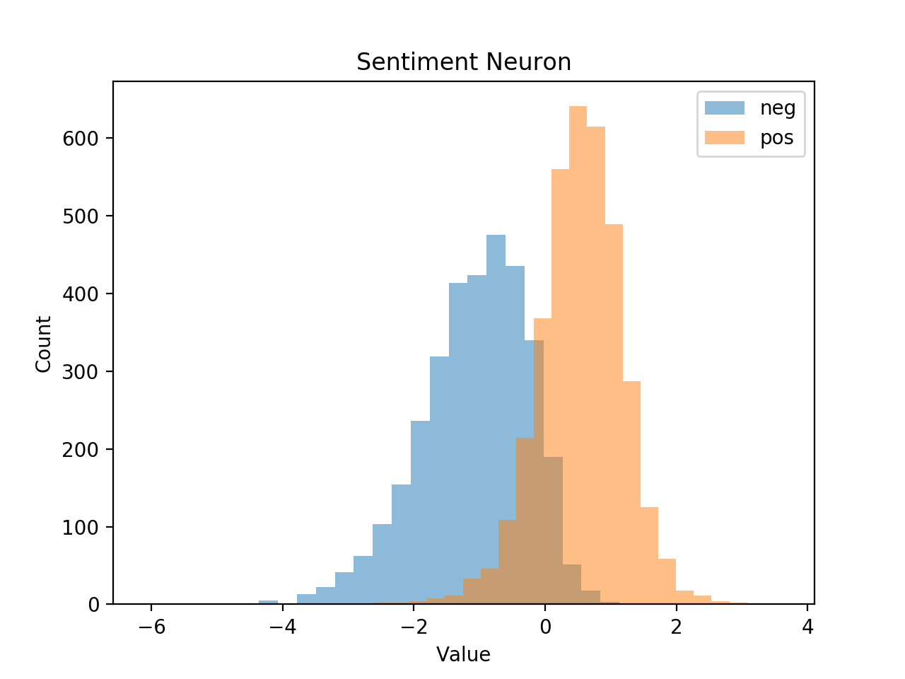
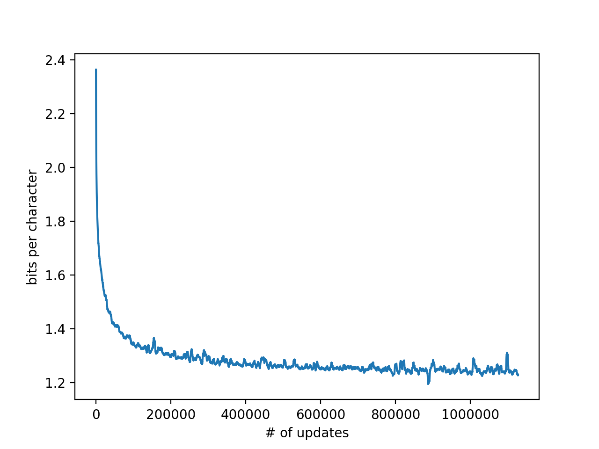

# Update
This repository is provided as is and will not be updated, If you are interested in the sentiment neuron work it might be worth checking out https://github.com/guillitte/pytorch-sentiment-neuron instead.

# Learning to Generate Reviews and Discovering Sentiment Reproduction

This repository provides a Tensorflow implementation of the model from the paper [Generating Reviews and Discovering Sentiment](https://arxiv.org/abs/1704.01444) by Radford et al. This code was created in an effort to reproduce the results reported in the original paper.

The authors of the work have released their fully trained model [here](https://github.com/openai/generating-reviews-discovering-sentiment), though they have not provided code to train a model from scratch.

This work has also been reproduced by Nvidia using the Pytorch framework, which can be found [here](https://github.com/NVIDIA/sentiment-discovery).

## Requirements

To run this code, access to a machine with one or more Nvidia GPUs is required. Tensorflow with GPU support, along with the necessary CUDA and CuDNN libraries must be installed, refer to the Tensorflow website for further details.

This code was developed using Python 2.7 and Tensorflow r1.4.

# Usage

## Quick Classify

run `cat ./model/994/x* > ./model/994/model.npy` to get the pre-trained model weights (Github has a 100Mb size limit on files so I had to split model.npy). Running `python sst_binary_demo.py` will classify the Stanford Sentiment data and generate a histogram of the Sentiment Neuron's values for each review.

## Data Preprocessing

The 'aggresively deduplicated' Amazon review dataset must be be requested for download [here](http://jmcauley.ucsd.edu/data/amazon/). The uncompressed file is a large JSON file (~58GB). In the paper the data is split into 1000 shards containing equal number of reviews. The `shard_data.py` file can be used to split the data into shards.

## Training

To train a model using multiple GPUs on the Amazon data, use `start_exp.sh`. This bash script loops through each shard of data and uses `multi-gpu-train.py` to process each shard. After processing a shard the model is saved. The model is then restored from the previously saved checkpoint before processing the next shard. This process is repeated until all of the shards have been processed.  

The `multi-gpu-train.py` script will create two directories: `saved_models` and `training_logs`.

`saved_models` is where the model checkpoints are saved. After training the model on a shard of data, the model is saved in a numbered subfolder corresponding to that shard. For example, after training the model on shard 0, the model is saved in `saved_models/0` which will contain two files: `model.npy`, which is a list of numpy arrays which are the model weights and `global_step.npy`, a scalar value which keeps track of the number of updates applied to the parameters and is also used to calculate the learning rate, which is decayed linearly to zero in the original work.

`training_logs` is used to save the loss of the network during training. These values are also saved in numbered subfolders after each shard is processed. For example after processing shard 0, `training_logs/0` will contain the loss for shard 0 which is saved in a file called `logs.npy`. The `logs.npy` file stores a (num_gpus + 1, num_updates) array, where each row is the loss for each GPU 'tower' at each time step and the last row is the average across towers. Tensorflow has built in tools (train.Saver() and summary.FileWriter() objects) for saving models and logs but because of the size of the model and data I found it was easier to save and load the models with numpy.

The `restore_exp.sh` script can be used to resume the training from a checkpoint simply by changing the range of the for loop. The training will likely crash at some point, because the training time is long, and so probably will need to be restored.

## Evaluation

`encoder.py` and `sst_binary_demo.py` have been taken from the code repository associated with the original paper [here](https://github.com/openai/generating-reviews-discovering-sentiment). The graphs below show some results from training over the Amazon dataset, which took approximately 1 month. The model was trained using a Google Compute instance with 4 Nvidia P100 GPUs. The fully trained model weights are in the `model` directory.

Training loss in bits per character, of the network over the course of training. This is the average loss over the four towers.

## Generation

`generate.sh` can be used to generate 'positive' and 'negative' samples from the trained model by setting the value of the sentiment neuron. Below are some examples of reviews which were generated using this code.

>This is the most easy to use product for the entire family. It's such fast delivery, and I love that it is so convenient (some reviews I've seen complain about it not working hot).

>This is the most hypocritical, difficult act that parents can purchase and comfortable then poorly drawn. All three very human individuals weren't the others--they just run a top-secret experiment.

>This is the most amazing story I have ever seen.  I really think it's great for historical reporting on both sides of the political spectrum.
 My horse was cursed with mad Trevor attack and she five months pregnant

 >This is the most exciting and captivating book I have read in a while.  Great story and characters.
 This like some of other Didion's books I have read it could be rather lengthy but I am pleasantly surprised at all

 >This is the most unique album I've ever heard, and anyone who's ever listened to a huge Sigur Ros album - before you believed - is worthy. And yes, parents account that to worship of Popular music, and true talent
